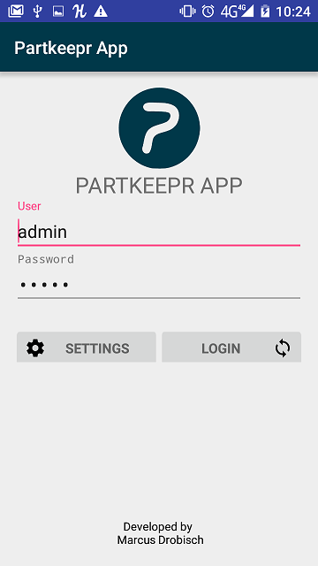
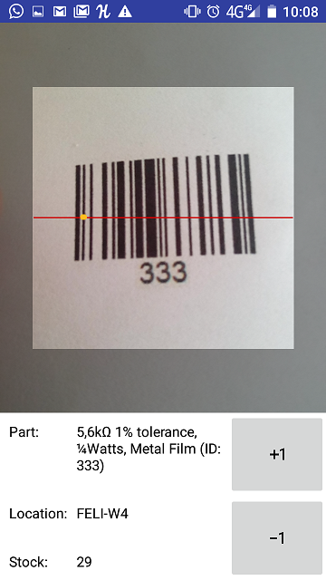
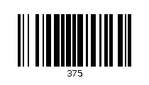

PartKeepr Scannr is an android app for Partkeepr with barcode support based on the zxing library.

 The App ist build for android versions 4.1 (AP 16) to 6.0 (AP 23).

For now only tested with the following devices:

- Samsung Galaxy S3 Mini, Android Jelly Bean, 4.2.2
- Cubot H1, Android Lolly Pop, 5.1.1
- Huawei P8 Lite, Android Marshmallow, 6.0.0

Please send me your model and android version, to get a meanigful list.

## Barcode Format

Partkeepr provide the component-imformation by a internal ID in the form of integer values (e.g. "375" for a "2N7000"-Diode).
The generated barcode have to follow this format. The barcode for the example would look like this.

The app  is using the Zxing-library to parse the tags.
You can use any barcode generator providing the following formats.

| 1D product | 1D industrial | 2D
| ---------- | ------------- | --------------
| UPC-A      | Code 39       | QR Code
| UPC-E      | Code 93       | Data Matrix
| EAN-8      | Code 128      | Aztec (beta)
| EAN-13     | Codabar       | PDF 417 (beta)

A good flexible barcode online generator is: http://www.barcode-generator.de/V2/de/index.jsp
E.g. use Code 128 and put "375" (without quotations marks) to get a valid barcode tag from above.
